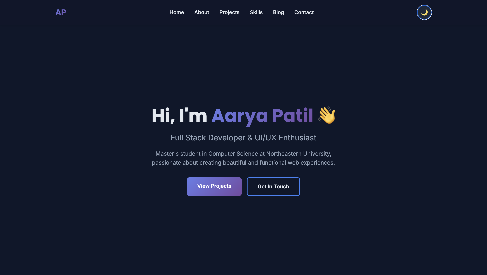

# Personal Homepage

A modern portfolio website built with vanilla HTML5, CSS3, and ES6+ JavaScript to showcase my projects and skills.

## Author

Aarya Patil  
Master's Student in Computer Science  
Northeastern University - Khoury College

## Website URL

https://aaryapatil113.github.io/personal-homepage/

## Class Information

**Course:** Web Development  
**Professor:** John Guerra Gomez  
**Semester:** Spring 2025  
**Class Link:** https://northeastern.instructure.com/courses/245751

## Project Objective

Create a personal portfolio that showcases my technical skills, projects, and experience in an engaging way. The goal was to build something  that stands out to recruiters and demonstrates proficiency in modern web development.

## Screenshot



## Key Features

- Interactive 3D flip cards for project showcase
- Dark/Light theme toggle with localStorage persistence
- Fully responsive design (mobile, tablet, desktop)
- Contact form with client-side validation
- Three separate pages (Home, Projects, Blog)
- Smooth scroll navigation
- AI-generated blog content

## Technologies Used

- HTML5 - Semantic markup
- CSS3 - Grid, Flexbox, 3D transforms, animations
- JavaScript (ES6+) - Modules, async/await, DOM manipulation
- Git/GitHub - Version control and deployment
- GitHub Pages - Hosting

## Project Structure
```
personal-homepage/
├── index.html              # Main homepage
├── projects.html           
├── blog.html              # AI-generated blog
├── css/
│   └── styles.css        
├── js/
│   ├── main.js           
│   ├── flip-cards.js     
│   ├── theme-toggle.js   
│   ├── projects-page.js  
│   └── blog-page.js      
├── images/               
├── design_document.md    
├── package.json          
├── .eslintrc.json     
├── .prettierrc          
└── README.md           
```

## Build Instructions

### Prerequisites
- Node.js installed (for development tools)
- Python 3 or any HTTP server (for local testing)
- Modern web browser

### Setup

1. Clone the repository
```bash
git clone https://github.com/Aaryapatil113/personal-homepage.git
cd personal-homepage
```

2. Install dependencies (for ESLint and Prettier)
```bash
npm install
```

3. Run local server (required for ES6 modules)
```bash
python3 -m http.server 8000
```

4. Open browser and navigate to
```
http://localhost:8000
```

### Development Commands
```bash
# Format code
npm run format

# Check code quality
npm run lint
```

## Creative Feature

The standout feature is the 3D flip card gallery for projects. Each card displays a project thumbnail and title on the front, then flips on hover to reveal a detailed description, features list, and action buttons.

On mobile devices, cards flip when tapped instead of hovered for a smooth touch experience.

## Use of AI Tools

I used Claude AI and google gemini

**How AI was used:**
- Debugging ES6 module issues during local development 
- Images werent loading for some reason.
- Troubleshooting Git merge conflicts 

**Example prompts used:**
- "What error is this exactly"
- "How do i merge my local and git, since changes were made on git only"
- "Why are the images not loading"

## Compliance Checklist

- W3C validated HTML
- ESLint compliant JavaScript
- Prettier formatted code
- All images have alt attributes
- Semantic HTML5 elements throughout
- ES6 modules with proper import/export
- No external frameworks or jQuery
- Responsive design with CSS Grid and Flexbox
- MIT licensed

## License

This project is licensed under the MIT License - see the LICENSE file for details.

## Acknowledgments

Professor John Guerra Gomez for the course instruction and guidance  
Northeastern University for educational resources  
Claude AI for assistance and debugging support

